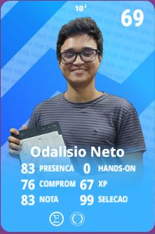
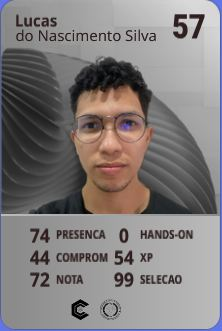

# DevTITANS 06 - HandsOn Final - Equipe 2 System UI

Bem-vindo ao repositório da Equipe 2 no DevTITANS! Este projeto está focado no desenvolvimento e personalização da interface do sistema (System UI). Especificamente:
- Animação de carregamento;
- Rotação automática com contexto no celular.

## Sumário
- [Contribuidores](#contribuidores)
- [Recursos](#recursos)
- [Uso](#uso)
- [Contato](#contato)

## Contribuidores

<div align="center">

<table>
  <tr>
    <td align="center"><br><b>Alcir Heber Castro Figueiredo</b><br>Responsável pela <i>Rotação de Tela</i></td>
    <td align="center"><br><b>Yan Lucas Cavalcante Rodrigues</b><br>Responsável pela <i>Rotação de Tela</i></td>
    <td align="center"><br><b>Odalisio Leite da Silva Neto</b><br>Responsável pelo <i>Port para o Motorola G100</i></td>
  </tr>
  <tr>
    <td align="center"><br><b>Pedro Jorge de Oliveira Sena Junior</b><br>Responsável pela <i>Animação de Carregamento</i></td>
    <td align="center"><br><b>Lucas do Nascimento Silva</b><br>Responsável pela <i>Animação de Carregamento</i></td>
  </tr>
</table>

</div>

## Recursos

Neste projeto utilizaremos os seguintes recursos e tecnologias:
- Android Open Source Project (AOSP)
- Motorola G100

## Uso

Para reproduzir as alterações na System UI, siga os passos abaixo:
1. Clone o repositório:
   ```bash
   git clone https://github.com/DevTITANS06/Equipe-2-System-UI.git

{Instruções para reproduzir as alterações no AOSP}
    
## Contato

Para perguntas, sugestões ou feedback, entre em contato com o mantenedor do projeto em [maintainer@example.com](mailto:maintainer@example.com).
